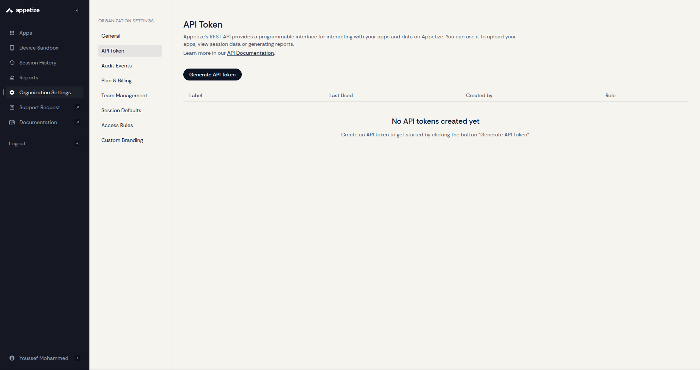
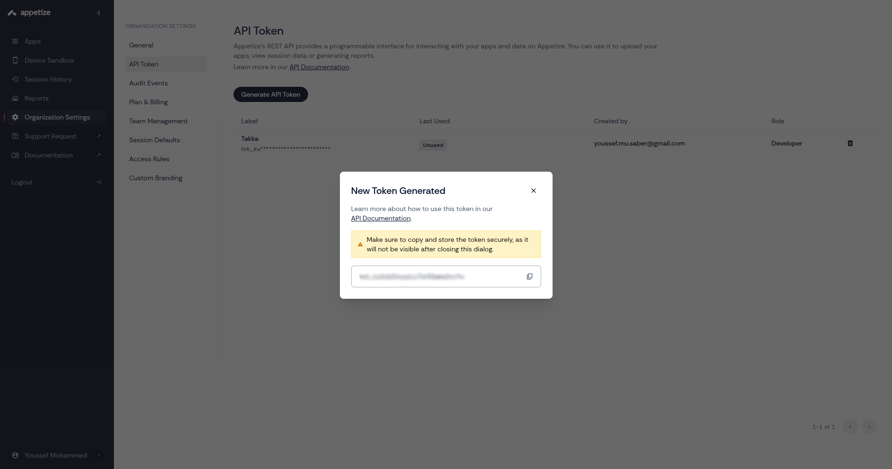
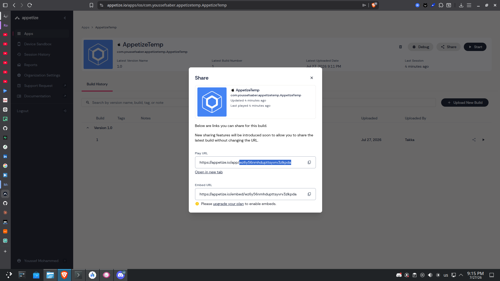

# KMP iOS CI/CD with GitHub Actions + Appetize.io

This project demonstrates how to set up a Continuous Integration pipeline that builds the **iOS target of a Kotlin Multiplatform (KMP)** project using GitHub Actions, and automatically deploys the build to **Appetize.io** so it can be previewed and tested directly in the browser — no physical device, no TestFlight, no local Xcode setup required for reviewers.

---

## Prerequisites

Before starting, make sure you have:

- A KMP project with an `iosApp/iosApp.xcodeproj` (default structure from the KMP wizard)
- A GitHub repository for the project
- An [Appetize.io](https://appetize.io) account (free tier works for testing)
- Admin access to the repo's **Settings → Secrets and variables → Actions** page

---

## Step 1 — Get your Appetize API Token

The API token authenticates your GitHub Actions workflow with your Appetize account so it's allowed to upload builds.

1. Log in to [appetize.io](https://appetize.io)
2. Go to **Account Settings** (click your profile icon → **Settings**)
3. Open the **API Token** tab

4. Click **Generate API Token** (or copy the existing one if you already have it)

5. Copy the token — you won't be able to see it again after leaving the page, so store it somewhere safe temporarily

> ⚠️ Treat this token like a password. Never commit it directly into your repo or workflow file.

---

## Step 2 — Get your Appetize Public Key

The public key identifies **which app** on Appetize your build should update. It's different from the API token.

**If this is your first upload (no app exists yet on Appetize):**
1. You can leave the public key blank for the first run — Appetize will create a **new app** and generate a public key for you.
2. After the first successful CI run, check your Appetize dashboard for the newly created app

**If you already have an app on Appetize:**
1. Go to your Appetize dashboard
2. Click on the app you want to update


3. Click on share and copy the last part of the Play URL as this is the Public key


---

## Step 3 — Add Secrets to GitHub

Your workflow needs these values available as encrypted secrets so they're never exposed in logs or code.

1. In your GitHub repo, go to **Settings → Secrets and variables → Actions**
2. Click **New repository secret** and add each of the following:

| Secret name | Value |
|---|---|
| `APPETIZE_API_TOKEN` | The API token from Step 1 |
| `APPETIZE_PUBLIC_KEY` | The public key from Step 2 (can be added/updated after first run) |
---

## Step 4 — Create the Workflow File

GitHub Actions workflows live in `.github/workflows/` at the root of your repo.

1. Create the folder structure if it doesn't exist:
   ```
   .github/workflows/
   ```
2. Inside that folder, create a file named `build-ios.yml`
3. Paste the following:

```yaml
name: Build iOS for Appetize

# Trigger manually from the Actions tab, or automatically on push to master/main
on:
  workflow_dispatch:
  push:
    branches: [ master, main ]

jobs:
  build-ios:
    # Xcode/iOS builds require a macOS runner
    runs-on: macos-latest
    steps:
      # Pull the repo contents onto the runner
      - name: Checkout code
        uses: actions/checkout@v4

      # Needed because Gradle (used to build the KMP/shared module) requires a JDK
      - name: Set up JDK 21
        uses: actions/setup-java@v4
        with:
          java-version: '21'
          distribution: 'temurin'

      # Caches Gradle dependencies/build output to speed up future runs
      - name: Setup Gradle
        uses: gradle/actions/setup-gradle@v3

      # Clean the Gradle build, then build the iOS app with Xcode
      - name: Build with Xcode
        run: |
          ./gradlew clean
          xcodebuild clean build \
                     -project iosApp/iosApp.xcodeproj \
                     -scheme iosApp \
                     -configuration Debug \
                     -sdk iphonesimulator \
                     -derivedDataPath build-ios \
                     -destination 'platform=iOS Simulator,name=iPhone 17,OS=latest' \
                     CODE_SIGNING_ALLOWED=NO \
                     CODE_SIGNING_REQUIRED=NO \
                     ENABLE_PREVIEWS=NO
                     # No code signing needed since this build only runs in the
                     # simulator (Appetize), not on a real device

      # Find the built .app bundle and zip it up so it can be uploaded to Appetize
      - name: Zip .app bundle
        run: |
          APP_PATH=$(find build-ios/Build/Products/Debug-iphonesimulator -name "*.app" -type d -print -quit)
          [ -z "$APP_PATH" ] && { echo "Error: .app bundle not found!"; exit 1; }
          (cd "$(dirname "$APP_PATH")" && zip -r "$GITHUB_WORKSPACE/iosApp.zip" "$(basename "$APP_PATH")")

      # Send the zipped .app to Appetize so it can be run/tested in the browser
      - name: Upload to Appetize
        uses: appetizeio/github-action-appetize@v1.0.5
        with:
          apiToken: ${{ secrets.APPETIZE_API_TOKEN }}
          publicKey: ${{ secrets.APPETIZE_PUBLIC_KEY }}
          appFile: iosApp.zip
          platform: 'ios'

      # Also keep a copy of the zip as a downloadable GitHub Actions artifact,
      # in case you want to grab the build without going through Appetize
      - name: Upload Artifact
        uses: actions/upload-artifact@v4
        with:
          name: ios-app-simulator
          path: iosApp.zip
          retention-days: 5
```

4. Commit and push the file.

---

## Step 5 — View Your Build on Appetize

Once the workflow finishes successfully:

1. Go to your Appetize dashboard — you'll see the app updated with the new build
2. Click the app to start testing it
3. You can share the app so anyone with the link can open it in a browser and interact with the simulator — no download required

[Demo Video.webm](https://github.com/user-attachments/assets/a520aad7-394a-42c4-be2b-d79c01440349)


You can also download the raw `.zip` from the **Artifacts** section of the completed GitHub Actions run, if you want the build without going through Appetize.
